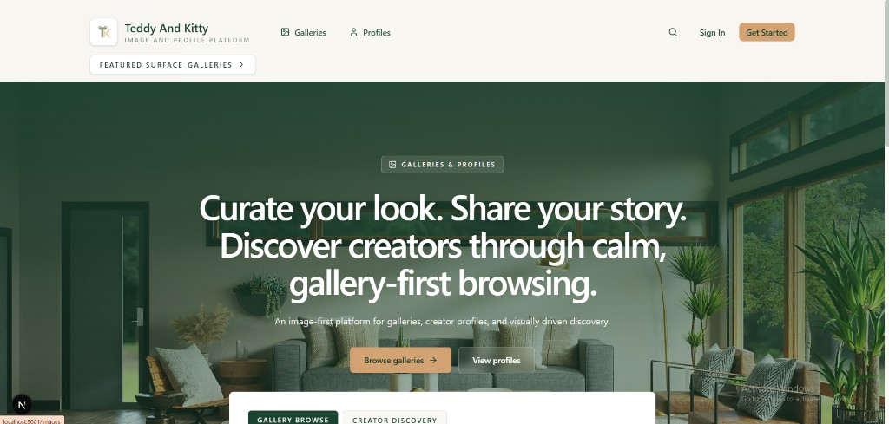
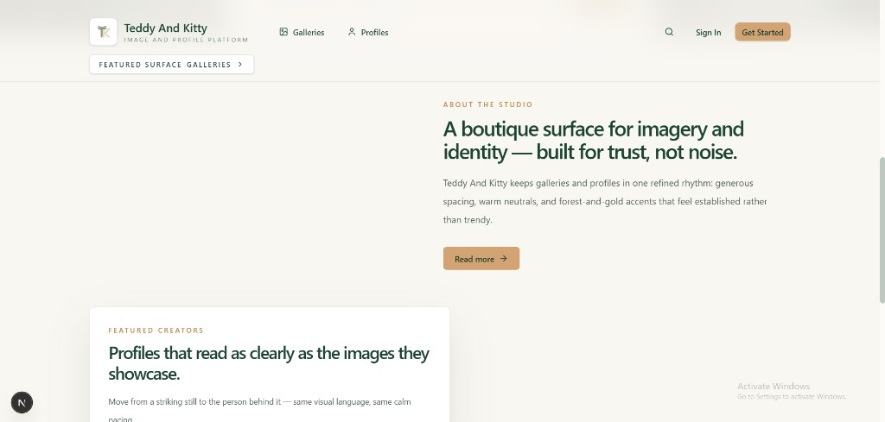
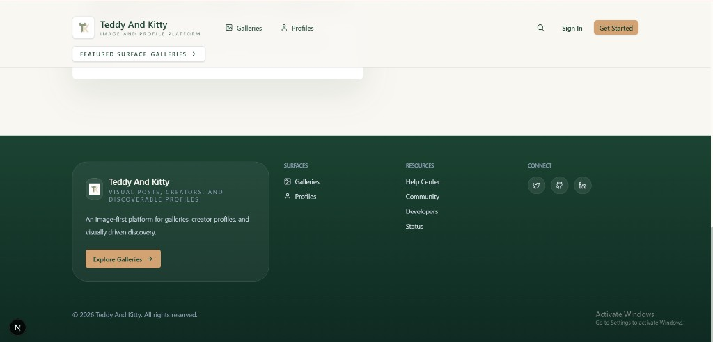
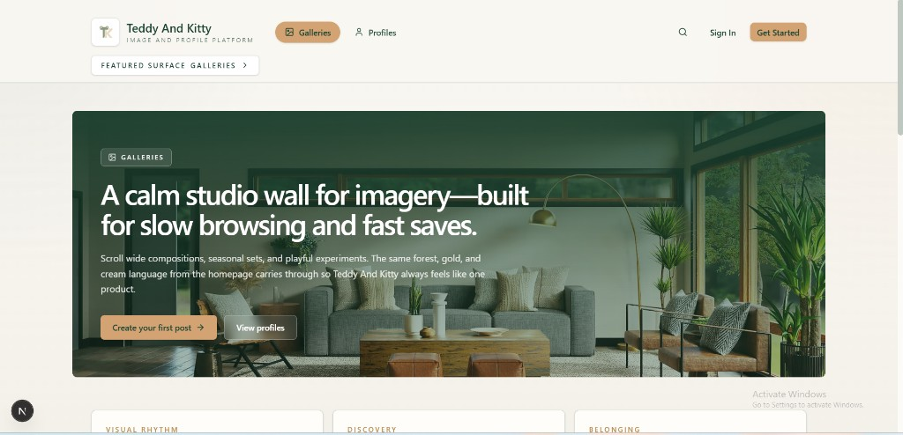
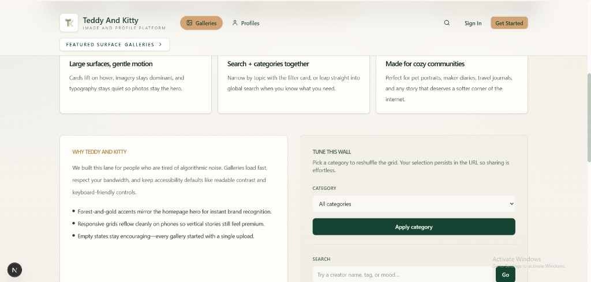
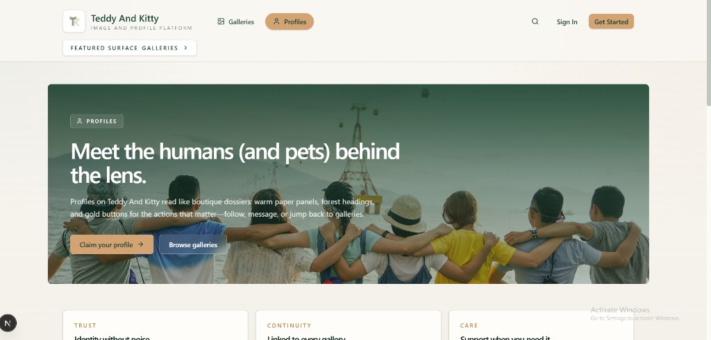
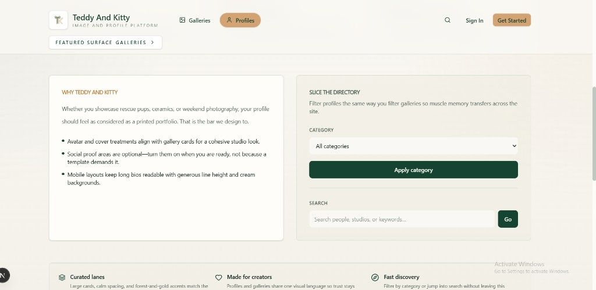
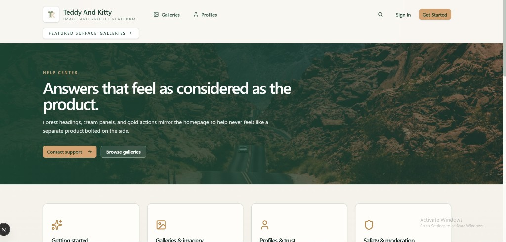

# Teddy And Kitty

Image-first platform for **galleries**, **creator profiles**, and calm visual discovery. Built with Next.js; forest green, cream, and gold UI.

## UI screenshots

Images are stored in-repo under [`docs/readme-screenshots/`](docs/readme-screenshots/) so they render on GitHub without external hosting.

### Homepage





### Header and footer



### Galleries





### Profiles





### Help Center



## Development

```bash
pnpm install
pnpm dev
```

Open [http://localhost:3000](http://localhost:3000).

## License

See the repository license file if one is provided.
